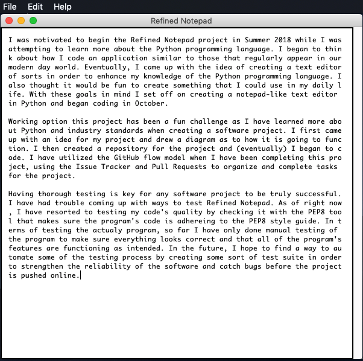

# refinedNotepad
A simple Notepad-like program using Python.

## Objective
To make a simple Notepad-like program using the Python programming language in order to strengthen and expand my understanding of Python. Add new features to the project that require different Python skills.

## Building & Running The Project
As the program is currently extremely basic, it can only be opened using Terminal. To do so, navigate to where the files for the program are located. Make sure you are in the src folder where the file `main.py` is located. Finally, make sure Python3 is installed on your machine.
Then, use the following command to run the program:
`python3 main.py`

## Testing The Program
 As of right, now the quality of the program's code is checked by the `.travis.yml` file every time something is pushed to the project repository to see if it adheres to the PEP8 style guide and standards. The project's writing quality is also checked using the `travis.yml` file using the Proselint tool. Currently there is no way to explicitly "test" the program other than by running it but basic test cases may be added to test some functions of the program.

## Software/Developmental Tools Used
There were a few different tools used to develop this project. Python3 was the programming language of choice for the program's development. Atom was used as the text editor where all of the coding was done and where all the project documentation was written. Additionally, the code follows the PEP8 style guide and standards, which are checked by the `.travis.yml` file every time a push is made to the project repository.

## Project Results
As this project is early in it's development there are not many results to share. Currently the user can create, open, and save basic text files. Additionally, there is a simple help menu.

Here is an example of the program in action:

