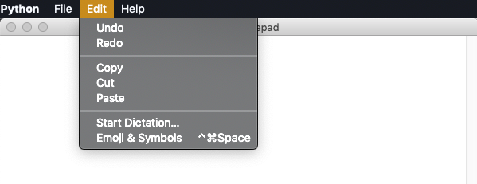
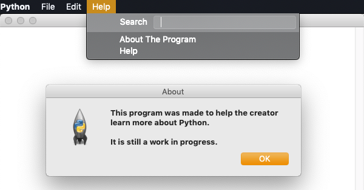

# refinedNotepadPython
A simple Notepad-like program using Python.

## What is refinedNotepad?
Refined Notepad is a simple text editor created using the Python programming language and a variety of other software development tools. The user can type in the text area and save to a `.txt` file with a name of their choice. There are also features such as an undo feature, redo feature, and more. These features allow for easier usability and more functionality for users of the program.

### Objective
To make a simple Notepad-like program using the Python programming language in order to strengthen and expand my understanding of Python. Add new features to the project that require different Python skills.

Additionally, another objective of this project was to teach me how to create GUIs in Python using the Tkinter package.
## Building & Running The Project
As the program is currently extremely basic, it can only be opened using Terminal. To do so, navigate to where the files for the program are located. Make sure you are in the src folder where the file `main.py` is located. Finally, make sure Python3 is installed on your machine.

Use the following command to run the program:
`python3 main.py`

## Testing The Program
As of right now, the quality of the program's Python code is checked by the `.travis.yml` file (Travis CI) every time something is pushed to the project repository to see if it adheres to the PEP8 style guide and standards. The project's writing quality is also checked using the `travis.yml` file using the Proselint tool. Currently there is no way to explicitly "test" the program other than by running it but basic test cases may be added to test some functions of the program in the near future.

## Software/Developmental Tools Used
There were a few different tools used to develop this project. Python3 was the programming language of choice for the program's development. Additionally, to create the GUI and many of the program's features, this project uses a Python package called Tkinter. The PEP8 tool was used to see if the program's Python code adheres to the PEP8 style guide and the tool Black was used to easily format code.

Atom was used as the text editor where all of the coding was done and where all the project documentation was written. GitHub was also used to house the repository for the project and to create branches where new features could be implemented and tested in.

## Project Results
This project is far from completed but there are a variety of results that have been acquired so far. The user can type whatever they desire in the text are of the notepad and the user can open, and save basic text files. The user can also perform basic text formatting in the form of copy, cut, paste, undo, and redo features. Additionally, there is a simple help menu with information about the program.

Here is an example of the program in action:

Here is the current format menu of the program:

Here is the current help menu of the program:

